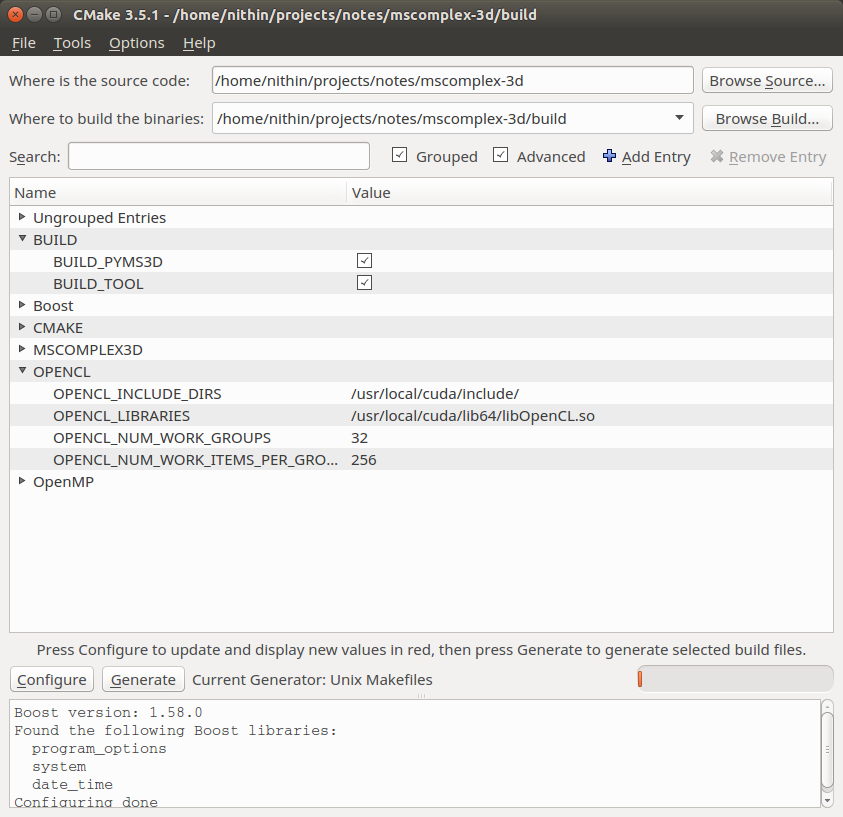

# **mscomplex3d** #

The project page is hosted [here](http://vgl.csa.iisc.ac.in/mscomplex/). More details on what the Morse-Smale complex and the algorithms etc are available on project page. 

The mscomplex3d computes the Morse-Smale complexes on 3d grids. Its available in two modules, either of wich can be used. 

- A python loadable module named **pyms3d**. Use of this module is recommended. See [pyms3d/examples](pyms3d/examples/).
- A command line tool named **mscomplex3d**. This is older and more cumbersome to use.

# Installation #

## Dependencies ##
- [Cmake](http://www.cmake.org/)
- OpenCL
- [OpenMP](http://openmp.org/wp/)
- [Python 3.7](http://python.org)
- [Pybind11 2.13](https://github.com/pybind/pybind11/releases/tag/v2.13.0) 

## Fetch and Compile ##

### Linux ###

```bash
$ git clone https://bitbucket.org/vgl_iisc/mscomplex-3d.git
$ cd mscomplex3d
$ git submodule update --init --recursive
$ cd ..
$ mkdir build install
$ cd build
$ cmake ../mscomplex-3d/ -DMSCOMPLEX_3D_INSTALL_DIR=../install  -DBUILD_PYMS3D=1  
$ make -j8
$ make -j8 install
```

### Windows ###


Run the above commands in bash shell. 

A binary executable named **mscomplex3d** must be present in the install directory. 
A python loadable module named **pyms3d** must be present in the install directory as well as in [pyms3d/examples](pyms3d/examples)

# OpenCL Installation #

OpenCL usually comes with the CUDA Computing Toolkit from Nvidia. It is recomended to install the entire toolkit to make use of the binary or python module.



# Pybind11 Installation #

The CMake file for the python module is configured to automatically download the Pybind11 dependency. It is not recommended to use any other Pybind.